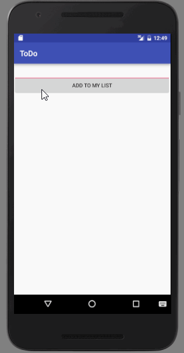

# To Do App

##### To Do App is an android app that allows building a todo list and basic todo items management functionality including adding new items, editing and deleting an existing item.

###### Submitted by: Young Don Ko

###### Time spent: 3 hours spent in total

User Stories

The following required functionality is completed:

•	[x] add and remove items from the todo list

•	[x] edit item with one click , with addin new item

•	[x] User can persist todo items and retrieve them properly on app restart

###### Video Walkthrough

License
Copyright 2016 Young Don Ko

Licensed under the Apache License, Version 2.0 (the "License");

you may not use this file except in compliance with the License.

You may obtain a copy of the License at

    http://www.apache.org/licenses/LICENSE-2.0

Unless required by applicable law or agreed to in writing, software
distributed under the License is distributed on an "AS IS" BASIS,
WITHOUT WARRANTIES OR CONDITIONS OF ANY KIND, either express or implied.
See the License for the specific language governing permissions and
limitations under the License.
